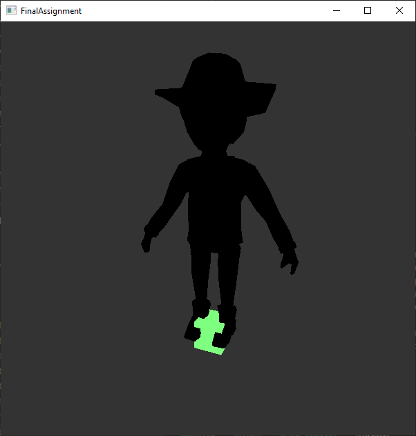
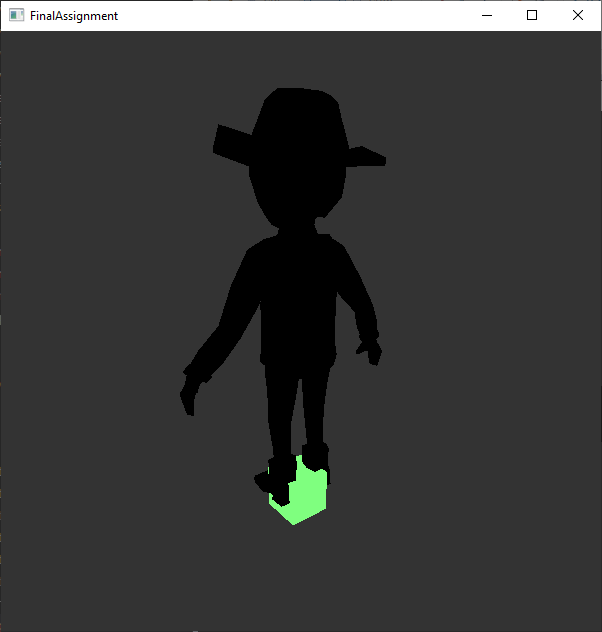
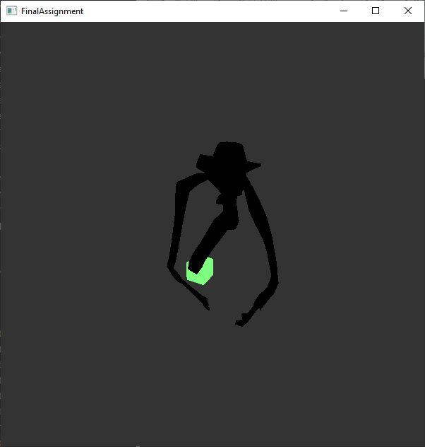
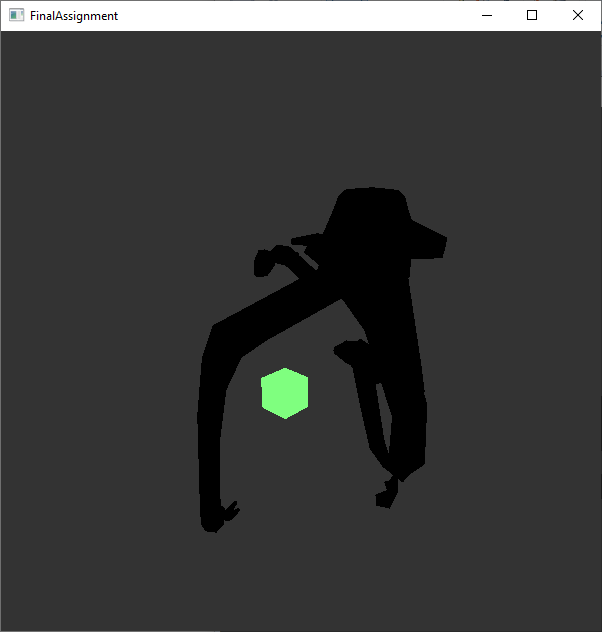
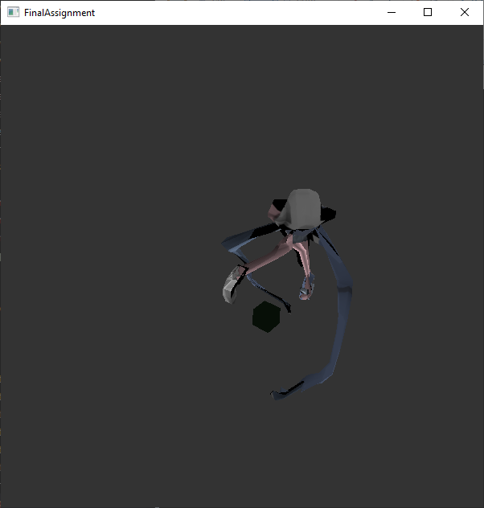
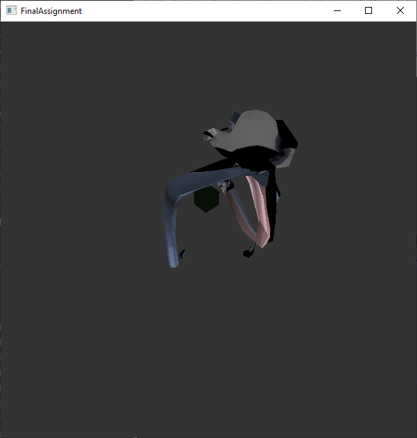

# 3GC3-FinalProject - Final Submission

Final Project for McMaster 3GC3 Fall 2021. Developing an animator using OpenGL.

## Group Members

Kenneth Mak, makk4, 001318946

Kunalpreet Matharu, mathak1, 400258512

## Compilation and Execution:
Running `make` in the root directory should generate the necessary files and run the `main` program. Be aware that constructing this will take approximately 1-2 minutes to compile all the necessary `.o` files for the first time.

Running `make clean` will remove all `*.o` object.

We noticed that there were some major discrepencies while developing on MacOS and WindowOS - functions are different, libraries are required, etc. We encountered several errors while developing between Windows and Mac operating systems. At the moment, we have only extensively tested this on Windows OS. We believe this may be due to some include files not being present on both operating systems. 

Finally, Shaders don't seem to compile on MacOS; specifically, the version number. MacOS is unable to use Shader versions over 120, whereas we need a minimum of version 130 to compile and use the shaders with our project.

MacOS - You can compile the program successfully, but the model and shaders are not functioning in the MacOS platform. We have included a [video link](https://youtu.be/PUBLOffYt8k) to our usage of the program, since we cannot compile on MacOS with shaders working. Alternatively, visit the [gallery](#gallery) for a quick view of the program.

## Expected Results
The program, once launched, will generate an screen of 600x600. On it should be two objects being rendered. The first is a T-Posing man with a cowboy hat standing straight up in the center of the world. The second is a green-box right underneath him.

The green box is placed as (0, 0, 0) and is used as a frame of reference in the scene.

The man is parsed from the `assets/model.DAE` file into an AnimatedModel object, and its feet should be placed at (0, 0, 0).

Pressing the `Spacebar` will toggle the shader program to animate and texture the model.

Pressing `t` will enable or disable textures  - You can see this change on the model, and on the box. When the box turns black, that means that textures are being rendered. If the box is green, that means textures are disabled.

## Final Submission
This project was for the development of a .DAE animation viewer made in OpenGL. 

### Rendering Models
In this phase, we focused on turning our loaded data from the ColladaLoader we developed in our prototype into an actual renderable model object. This meant turning and loading the read data from the `ColladaParser/DataStructures/` into actual classes, such as an `Animation` and `AnimatedModel` class.

We developed loaders (i.e. an `AnimatedModelLoader`) inside of a `Loaders` file - these loaders are in charge of loading from the ColladaLoader data structures and parsing them into actual objects (I.e. VAO models, loading skeleton data, Textures). Once these objects are initialized, these objects are sent to the `AnimatedModel` constructor as parameters. 

Once we binded and stored our appropriate data into the `VBO`s & `VAO`s and placed these in an `AnimatedModel` class, we started trying to render the actual `AnimatedModel` class. 

We created a `Scene` class that takes in the `AnimatedModel`, and on each `render` call, binds the appropriate VAO from the `AnimatedModel` and calls `glDrawElements`. This will draw the necessary amount of triangles with the given vertices stored in the binded vertex array. 

This result can be seen in the initial state of the program - a T-posing model shows that we have successfully drawn from the binded vertex array.

### Animations
We also began working on the `Animator` class to accurately move each joint transform based on the given data. This `Animator` would taken in an `Animation` and the root joint of an `AnimatedModel` class, and change the entire joint heirachy of the `AnimatedModel` based on the given `Animation`. This means that each time the `AnimatedModel` is called to update, its root joint is changed by the `Animator` with its given animation. These files can be found inside `Animation`

This is also where we begin to work on a Shader program - from what we can understand, a shader program takes in inputs from the CPU and outputs the changed values - for example, for animations, instead of manually changing every vertex information from VAO, we would instead pass to the shader the new joint transforms from the current animation, and let the shader render the new model with vertices from the VAO and the joint relative to their joint transform.

Shader specific files can be found in `Engine/Shaders` and `Engine/Uniform`.

Pressing `Spacebar` will enable the Shader program - you should see some movement from our formerly T-pose model.

However, we seem to have an issue in that our animation is not accurate - it moves like an abomination, instead of our model doing a running animation. We believe this is due to the shader outputting incorrect vertices, either to how the calculations are done, or to our input uniforms being incorrect. After spending several hours on debugging and checking if our values are correct, and struggling with pointers and references, we were unable to discover the problem.

On the bright side, the model now correctly renders over (0, 0, 0), represented by a cube. This means that we have the Model-View-Projection matrix that is multiplied by the final value set up correctly (i.e. the model now renders in world space, instead of being stuck to the camera position).

Note: We believe this shader program may have issues loading from our Eigen::Matrix4f library - GLSL mat4 is column first, whereas Eigen::Matrix4f and other standard l ibraries are row first. The JointTransforms being returned may also be incorrect, leading to strange joint stretches.

### Textures
Finally, we attempted to load a texture onto our model. From data loaded in the ColladaLoader, texture locations for each vertex should have already been loaded. These files can be located inside of `Engine/Textures`. Since we are loading textures from a `.png` file, we imported the `stb_image.h` library to decode `png` files to be used for OpenGL textures.

We placed static functions inside of `TextureUtils` to read data from .PNGs, and to load data into OpenGL. Our `.png` file is loaded to a `TextureData` object, which contains the width, height, and the data array containing the `.png` information. We also created a `TextureSettings` class, that contains various boolean variables indicating how we want the Texture parameters to be set.

Finally, we construct a `Texture` object using `TextureData` and `TextureSettings`. We then load the data from `TextureData` into OpenGL by generating textures using `glGenTextures` and using `glBindTexture` with a stored `GLuint[]` from `Texture` to ensure that the data is loaded and binded, and can be accessed with the `Texture` class. This `Texture` class is then sent to the `AnimatedModel` class.

When the `AnimatedModel` needs to be rendered, the `Scene` class will now also access this `Texture` variable and tell it to bind, so that OpenGL will use this texture. The shader program will now use the given texture point inputs it is given when it was created, and take from this texture binded from `glBindTexture`.

Press `t` to toggle whether textures should be used (i.e. whether OpenGL will `glBindTexture`).

As before, the shader seems to have some issues, but this time with Textures - our model is no longer a completely black entity, and has some textures on them - unfortunately, the textures are not correct, and instead have random parts of our texture drawn over each 'limb'.

### Shader Program
At the moment, the shader program is what moves (with Vertices, JointIDs, and Weights) and provides textures (Texure_coords, Normals) to our model. It has been told to bind to certain areas using `glBindAttribLocation`. This is where the following vertex attribute arrays are binded to:
- 1. "in_position"
- 2. "in_textureCoords"
- 3. "in_normal"
- 4. "in_jointIndices"
- 5. "in_weights"

However, something seems go wrong when the Shader takes these inputs and outputs them to the engine - either it isn't reading from the correct locations (maybe due to changed value from a pointer), or the calculations in the `.glsl` files are incorrect, or we are loading input information incorrectly into the uniforms (i.e. glsl mat4 orientation is different from row-major Eigen::Matrix4f).

### Camera
Our camera currently mimics that of a FPS view, where you can strafe with the WASD keys and pan with the Mouse. It accurately moves based on the direction of the camera's forward, instead of the world camera.

We would also use grab the GL_PROJECTION_MATRIX and GL_MODELVIEW_MATRIX of the current OpenGL camera in order to send to the matrix to calculate the Model-View-Projection matrix used to translate our model from model space to camera space.  Now, instead of having the model be rendered at (0, 0, 0) (i.e. directly on the camera) and following the camera, we have the model be rendered in world space at (0, 0, 0). We placed a green cube at (0, 0, 0) to show reference to the model.

### Lighting
The `Scene` object also generates lighting using a Vector3. This Vector3 is also passed to the ShaderProgram, specifically EntityFragment.glsl, the fragment shader. This will apply pseudo lighting to the texures.

## Gallery
### On Initialization

### Shader Enabled (Spacebar)

### Textures Enabled ('T')

## External Resources:
### Guides
We are using the Eigen3 libraries for their Matrices, Vectors, and Quaternions.
- Link to their homepage: https://eigen.tuxfamily.org/

We utilize the `stb_image.h` library to decode the `.png` files into textures for our model
- https://github.com/nothings/stb/blob/master/stb_image.h 

We follow this guide for the basics of vertex arrays, vertex buffers, and shaders
- https://learnopengl.com/Getting-started/Hello-Triangle
- https://learnopengl.com/Getting-started/Shaders
- https://learnopengl.com/Getting-started/Textures
- https://www.youtube.com/watch?v=WMiggUPst-Q

We have been following a playlist of guides that was developed using Java and OpenGL.
- Link to the OpenGL Skeletal Animation: https://www.youtube.com/watch?v=f3Cr8Yx3GGA 

Several other guides we have used:
- http://www.opengl-tutorial.org/beginners-tutorials/tutorial-7-model-loading/ 
- http://wazim.com/collada-tutorial1/ 

### Models
- Model from the YouTube playlist located in the description of video
- Link to the OpenGL Skeletal Animation: https://www.youtube.com/watch?v=f3Cr8Yx3GGA 
